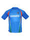
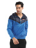
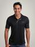
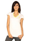
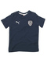
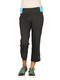
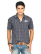

# Fashion Fusion

## Project Overview

Over 8,003 images of 28 different classes.

## Link Dataset

-   This dataset available on Kaggle: https://www.kaggle.com/datasets/paramaggarwal/fashion-product-images-dataset

**_Please refer to 'dataset' on this link for full data_**  
&nbsp;&nbsp;&nbsp;&nbsp; We've already converted the images into ndarray and save them to **.npz** for ease of use and fast processing. You can refer to the file **'Convert_img_to_ndarray.ipynb"** how we did this conversion. Furthermore, for **shoes category**, before we train/val, we need to do **data augmentation** too because shoes have a direction that they are pointing to, if we didn't do any augmentation when it see the real world images in the different direction, it will have trouble classifying them. We provide some examples of our images data in **'Sample images (Full size)'** folder.  
Here are some examples:  

